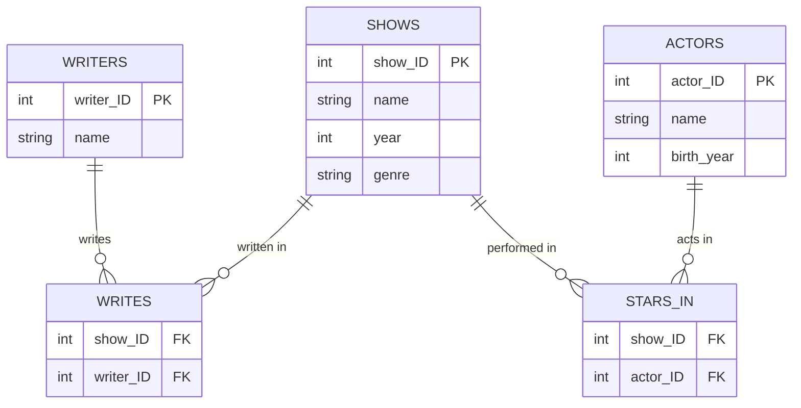

# TV Show Database Design

```mermaid
erDiagram
  WRITERS ||--o{ WRITES : writes
  SHOWS ||--o{ WRITES : "written in"
  SHOWS ||--o{ STARS_IN : "performed in"
  ACTORS ||--o{ STARS_IN : "acts in"

  WRITERS {
    int writer_ID PK
    string name
  }

  SHOWS {
    int show_ID PK
    string name
    int year
    string genre
  }

  ACTORS {
    int actor_ID PK
    string name
    int birth_year
  }

  WRITES {
    int show_ID FK
    int writer_ID FK
  }

  STARS_IN {
    int show_ID FK
    int actor_ID FK
  }
```